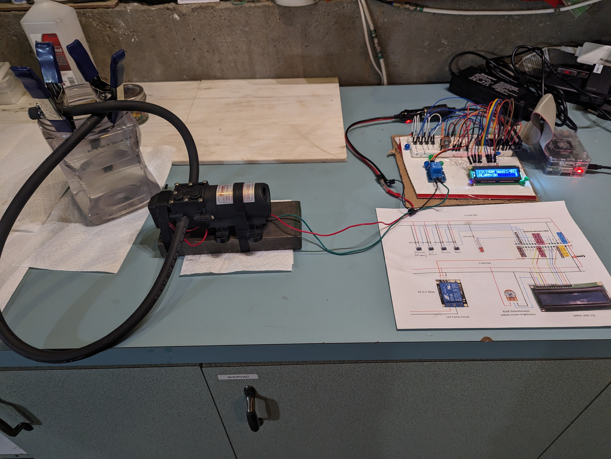
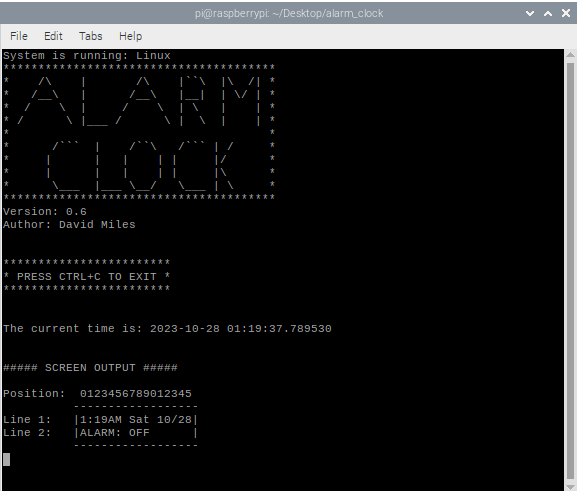
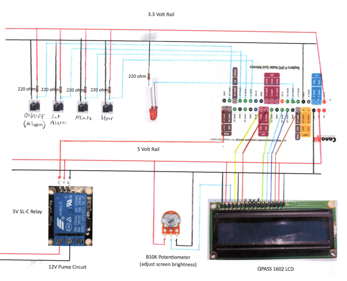
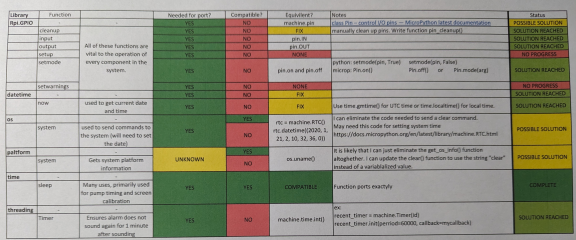

# Water Alarm Clock

## Table of Contents
<details><summary>Click to expand...</summary>  

**- [Project Description](#project-description-1)**  
    &emsp;- [About the Product](#about-the-product)  
    &emsp;- [Inspiration](#inspiration)  
    &emsp;- [Project Showcase](#project-showcase)  
    &emsp;&emsp; [Video Overview](#video-overview)

**- [Project Credits](#project-credits)**  
    &emsp;- [Jonathan Hoffman](#jonathan-hoffman---product-owner)  
    &emsp;- [Tom Ryan](#tom-ryan---consulting-engineer)  
    &emsp;- [David Miles](#david-miles---software-developer)  

**- [Documentation](#documentation-1)**  
    &emsp;- [Using Water Alarm](#using-water-alarm)  
    &emsp;- [Technical Notes](#technical-notes)  
    &emsp;- [Hardware](#hardware)  
    &emsp;- [Design](#design)  
    &emsp;- [Software](#software)  
    &emsp;&emsp;- [Current Version](#current-version-10)  
    &emsp;&emsp;- [Future Versions](#future-versions)  
    &emsp;&emsp;- [Previous Versions](#previous-versions)  
</details>

---

## Project Description

### About the Product

This is a project in development to create an alarm clock that will spray you with water to help heavy sleepers get out of bed in the morning.

---

### Inspiration

This idea was conceived by Jonathan Hoffman, who has always thought outside of the box. He is a heavy sleeper, and wants something to get him moving quickly in the moring.

---

### Project Showcase
Contents: 
[Video Overview](#video-overview) - 
[Product Image](#product-image) - 
[Design](#design)

---

#### Video Overview

**Click here to see a video about the project in it's current state:**  
**[Video Overview](https://photos.app.goo.gl/3kBqhnxbUV3KdRak7)**


#### Product Image
&emsp;- The alarm clock as of version 1.0:  



#### Debug Console
&emsp;- The debug interface as of version 0.6:  



>This interface was used to:
>>**Test individual components of the project.** For example, when testing the buttons I would print a message to the screen when each button was depressed.
>
>>**Display the values of important variables.** When debugging, it was invaluable to know how my variables were set.
>
>>**Display the expected LCD output.** I sent the same string to the console as to the LCD. As I was getting the screen working, this was helpful because I knew if I didn't get the correct output, it was probably an error in my wiring. 
>

---

## Project Credits

### Jonathan Hoffman - Product Owner
>Jonathan, or "Jono" as his friends call him, is the one who initiated this project. He is largely responsible for the mechanical design, and has selected pump and circuit equipment to be used in product construction.

### Tom Ryan - Consulting Engineer
>Tom has been an instrumental part of product testing, solution design, and general consulting. 

### David Miles - Software Developer
>David is responsible for the software and small electronics portion of the project. He is also the one maintaining the project documentation.

---

## Documentation:
Contents: 
[Using Water Alarm](#using-water-alarm) - 
[Hardware](#hardware) - 
[Design](#design) - 
[Software](#software)  

---

### Using Water Alarm:
Contents:
[Setting the Alarm](#setting-the-alarm) - 
[Setting the Snooze](#setting-the-snooze) - 
[Priming the Pump](#priming-the-pump)

#### Setting the Alarm  
>>1. Turn the alarm on by pressing the ON/OFF button. The screen should display "ALARM:ON"  
>  
>>2. Hold down the 'SET ALARM' button. The alarm time should appear on the screen.  
>  
>>3. With the 'SET ALARM' button depressed, press the 'HOUR' and 'MINUTE' buttons to set the alarm time.  
>  
>>4. Release the set alarm button. You can check the alarm time at any time by pressing the 'SET ALARM. button.  
>

#### Setting the Snooze

Note: Currently the only way to adjust the snooze is through the **config.py** file. Future versions will include a button for this feature.

>>1. Open config.py with a text editor or the terminal:  
>>```bash
>>cd path/to/config.py
>>sudo nano 
>>```
>  
>>2. Set `SNOOZE_COUNT_CONFIG = #` where "#" is the number of times you would like snooze to sound (the pump to activate) in the one minute following the first alram. Values are listed below for reference.
>>
>>&emsp;`SNOOZE_COUNT_CONFIG = 1` (default setting): Alarm will sound once more. The number of seconds between the intial alarm and the snooze alarm is determined by MAX_SNOOZE_TIME.
>>
>>SNOOZE COUNT CONFIG...  
>>&emsp;&emsp;&emsp;&emsp;=1: See above.  
>>&emsp;&emsp;&emsp;&emsp;=2: Alarm will sound at +29 seconds and +58 seconds.  
>>&emsp;&emsp;&emsp;&emsp;=3: Alarm will sound at +19, +38 seconds and +57 seconds.  
>>&emsp;&emsp;&emsp;&emsp;=4: Alarm will sound +14, +28, +42, and +56 seconds.  
>  
>>3. Set `MAX_SNOOZE_TIME` (default=30): The time in seconds between the intial alarm and the snooze alarm when SNOOZE_COUNT_CONFIG = 1.
>>
>>&emsp;Algorithm for determining snooze activation times:  
>>&emsp;`DELAY_TIME = (60 / SNOOZE_COUNT_CONFIG) - 1`

#### Priming the Pump
>>1. Fill pump reservoir.
>  
>>2. Ensure you have something to catch the water ejected during priming.
>  
>>3. Press 'HOUR' AND 'MINUTE' buttons at the same time. Pump will run for 1 second.
>  

---

### Technical Notes

Contents: 
[Dependencies](#dependencies) - 
[Installation (Raspberry Pi 4)](#install-on-raspberry-pi-4) - 
[Run on Startup](#configure-to-run-on-startup)

#### Dependencies:
>**- Python**  
>Python is natively installed on the Raspberry Pi Pico that will be used in Version 1.0. However, python can be downloaded and installed here: [Install Python](https://www.python.org/downloads/)

#### Install on Raspberry Pi 4:
>>1. Configure git:  
>>&emsp;a. Install git: [Click Here To Install Git](https://git-scm.com/book/en/v2/Getting-Started-Installing-Git)
>>&emsp;b. Configure:  
>>```bash
>>git config --global user.name "yourusername"  
>>git config --global user.email "your@email"  
>>```  
>>&emsp;c. Create GitHub Access Token: [Instructions here](https://docs.github.com/en/authentication/keeping-your-account-and-data-secure/managing-your-personal-access-tokens#creating-a-personal-access-token-classic)  
>>**SAVE THIS KEY IMMEDIATELY! YOU WILL NOT BE ABLE TO ACCESS IT AGAIN.**  
>  
>>2. Clone repo:  
>>&emsp;a. In the terminal, navigate to your desired directory and enter this command:  
>>```bash
>>git clone https://github.com/DavidMiles1925/water_alarm_clock.git  
>>```
>>&emsp;b. You will be prompted for username and key (it is labeled password).  
>>**Copy and paste the key generated in step 1c as the password.**  
>  
>>3. Run program:
>>&emsp;a. Run program in console:  
>>```bash
>>cd path/to/program
>>python main.py
>>```
>>&emsp;b. [Configure for startup](#configure-to-run-on-startup)
>  

#### Configure to Run On Startup:
>>1. Modify etc/rc.local with admin priviliges:  
>>```bash
>>cd /etc
>>sudo nano rc.local
>>```
>>
>>2. Added this line to /etc/rc.local:  
>>```bash  
>>sudo python /home/pi/water_alarm_clock/main.py &  
>>```  
>  
>>3. To stop the process, first find the pid number:  
>>```bash  
>>ps aux | grep "main.py"  
>>```  
>  
>>4. Note the number in the second column.  
>  
>>5. Terminate process:  
>>```bash
>>sudo kill -TERM ###  
>>```  
>>&emsp;*replace "###" with the number from step 4

---

### Hardware:

>Pump info needed  
>Converter info needed  
>[Raspberry Pi 4 (Pico in future versions)](https://www.raspberrypi.com/products/raspberry-pi-4-model-b/specifications/)
>[1602 LCD Screen](https://lastminuteengineers.com/arduino-1602-character-lcd-tutorial/)  
>[B10K Ohm Potentiometer](https://components101.com/resistors/potentiometer)  
>[5V SL-C Relay](https://www.datasheetcafe.com/srd-05vdc-sl-c-datasheet-pdf/)  
>[4-pin buttons x4](https://components101.com/switches/push-button)  
[>Pack of Jumper Wires](https://www.amazon.com/EDGELEC-Breadboard-Optional-Assorted-Multicolored/dp/B07GD2BWPY/ref=mp_s_a_1_4_maf_2?keywords=jumper+wires&qid=1698723823&sr=8-4)
>[220 Ohm Resistors x5](https://www.amazon.com/EDGELEC-Resistor-Tolerance-Multiple-Resistance/dp/B07QK9ZBVZ/ref=asc_df_B07QK9ZBVZ/?tag=hyprod-20&linkCode=df0&hvadid=366282353997&hvpos=&hvnetw=g&hvrand=1493730756178399250&hvpone=&hvptwo=&hvqmt=&hvdev=m&hvdvcmdl=&hvlocint=&hvlocphy=9023859&hvtargid=pla-804889355024&psc=1&tag=&ref=&adgrpid=79957163727&hvpone=&hvptwo=&hvadid=366282353997&hvpos=&hvnetw=g&hvrand=1493730756178399250&hvqmt=&hvdev=m&hvdvcmdl=&hvlocint=&hvlocphy=9023859&hvtargid=pla-804889355024)  
>LED  

---

### Design



---

### Software:
Contents: 
[Current Version](#current-version-10) - 
[Dependencies](#release-notes) - 

---

#### Current Version: 1.0  

This version is a fully functional version of the software that has been tested with the hardware. The next step is to build a prototype of the final Water Alarm product. In the meantime, I will begin work on Version 1P which will be a port of the current software to MicroPython.

---

#### Release Notes:

##### Version 1P: A device port to Raspberry Pi Pico.
&emsp;- Port to Raspberry Pi Pico:  
&emsp;- Remove console outputs  
&emsp;- Remove OS specific components  
&emsp;- add "no internet" mode  
&emsp;- Project tuning  

>**Notes on porting to Pico:**  
>   - Need to test with MicroPython  
>   - Need to write code for setting clock  
>               **OR**  
>   - Need to find a way to ping for internet  

Port plan created during version iteration 0.6:



---

#### Previous Versions:

<details>
    <summary>Click to expand...</summary>

##### Version 1.0
&emsp;- created set_system_time() function  
&emsp;- added set time logic  
&emsp;- README:  
&emsp;&emsp;- add set time instructions  

##### Version: 0.7  
>&emsp;- added snooze feature  
>&emsp;- tweaked snooze output  
>&emsp;- adjusted lcd performance  
>&emsp;- README:  
>&emsp;&emsp;- added overview video  
>&emsp;&emsp;- added technical notes section  
>&emsp;&emsp;- general fixes  

##### Version 0.6  
>&emsp;- configured to run on startup  
>&emsp;- Minor improvements:  
>&emsp;&emsp;- optimized sleep times  
>&emsp;&emsp;- added exit message on lcd  
>&emsp;&emsp;-re-introduced debugging for porting  
>&emsp;- Reformated board layout for efficiency  
>&emsp;- README:  
>&emsp;&emsp;- Project recap  
>&emsp;&emsp;- Videos/images  
>&emsp;&emsp;- add hardware links  
>&emsp;&emsp;- add screen wiring diagram  


##### Version 0.5  
>&emsp;- added AM/PM logic  
>&emsp;- formated output for AM/PM  
>&emsp;- integrated screen  
>&emsp;- calibrated potentiometer  
>&emsp;- generated screen output to match debug output  
>&emsp;- reformatted code for easier reading


##### Version 0.4  
>&emsp;- Created basic alarm logic  
>&emsp;- integrated indicator LED  
>&emsp;- integrated relay circuit  
>&emsp;- test all components  


##### Version 0.3  
>&emsp;- Set up GPIO pins  
>&emsp;- integrated buttons:  
>&emsp;&emsp;- alarm on/off  
>&emsp;&emsp;- set alarm  
>&emsp;&emsp;- hour  
>&emsp;&emsp;- minute  
>&emsp;- configured button logic  
>&emsp;- console debug formatting adjustments  
>&emsp;- README:  
>&emsp;&emsp;- added table of contents  


##### Version 0.2  
>&emsp;- adjusted time output formatting  
>&emsp;- created debug output to console  
>&emsp;- README update:  
>&emsp;&emsp;- hardware  
>&emsp;&emsp;- future versioning  


##### Version 0.1  
>&emsp;- Created main function  
>&emsp;- Created basic utilities library  
>&emsp;- Created configuration file  
>&emsp;- Initialized repository  
>&emsp;- Incorporated bare-bones error handling  
>&emsp;- Started README  

</details>
