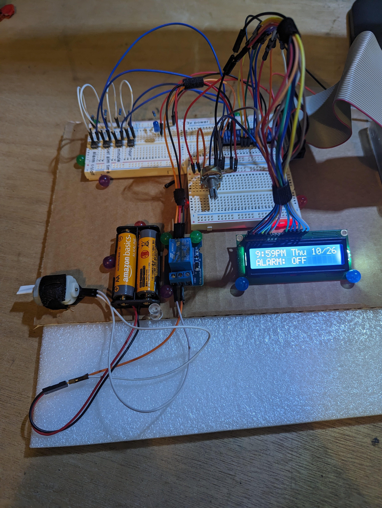

# Water Alarm Clock

## Table of Contents  
**- [Project Description](#project-description-1)**  
    &emsp;- [About the Product](#about-the-product)  
    &emsp;- [Inspiration](#inspiration)  
    &emsp;- [Project Showcase](#project-showcase)  

**- [Project Credits](#project-credits)**  
    &emsp;- [Jonathan Hoffman](#jonathan-hoffman---product-owner)  
    &emsp;- [Tom Ryan](#tom-ryan---consulting-engineer)  
    &emsp;- [David Miles](#david-miles---software-developer)  

**- [Documentation](#documentation-1)**  
    &emsp;- [Hardware](#hardware)  
    &emsp;- [Software](#software)  
    &emsp;&emsp;- [Dependencies](#dependencies)  
    &emsp;&emsp;- [Current Version](#current-version-06)  
    &emsp;&emsp;- [Future Versions](#future-versions)  
    &emsp;&emsp;- [Previous Versions](#previous-versions)  

---

## Project Description

### About the Product

This is a project in development to create an alarm clock that will spray you with water to help heavy sleepers get out of bed in the morning.

---

### Inspiration

This idea was conceived by Jonathan Hoffman, who has always thought outside of the box. He is a heavy sleeper, and wants something to get him moving quickly in the moring.

---

### Project Showcase

The alarm clock as of version 0.5:



The debug interface as of version 0.6:


>This interface was used to:
>>**Test individual components of the project.** For example, when testing the buttons I would print a message to the screen when each button was depressed.
>
>>**Display the values of important variables.** When debugging, it was invaluable to know how my variables were set.
>
>>**Display the expected LCD output.** I sent the same string to the console as to the LCD. As I was getting the screen working, this was helpful because I knew if I didn't get the correct output, it was probably an error in my wiring.
>

---

## Project Credits

### Jonathan Hoffman - Product Owner
>Jonathan, or "Jono" as his friends call him, is the one who initiated this project. He is largely responsible for the mechanical design, and has selected pump and circuit equipment to be used in product construction.

### Tom Ryan - Consulting Engineer
>Tom has been an instrumental part of product testing, solution design, and general consulting. 

### David Miles - Software Developer
>David is responsible for the software and small electronics portion of the project. He is also the one maintaining the project documentation.

---

## Documentation:

### Hardware:

---

>Pump info needed  
>Converter info needed  
>Raspberry Pi 4 (Pico in future versions)  
>[1602 LCD Screen](https://lastminuteengineers.com/arduino-1602-character-lcd-tutorial/)  
>[B10K Ohm Potentiometer](https://components101.com/resistors/potentiometer)  
>[5V SL-C Relay](https://www.datasheetcafe.com/srd-05vdc-sl-c-datasheet-pdf/)  
>[4-pin buttons x4](https://components101.com/switches/push-button)  
>Jumper Wires (many assorted m-f, f-f, m-m)  
>220 Ohm Resistor  
>10K Ohm Resistors x4
>LED  

---

### Software:

---

#### Dependencies:

>**- Python**  
>Python is natively installed on the Raspberry Pi Pico that will be used in Version 1.0. However, python can be downloaded and installed here: [Install Python](https://www.python.org/downloads/)

---

#### Current Version: 0.6  
    - configured to run on startup  
    - Minor improvements:  
        - optimized sleep times
        - added exit message on lcd
        -re-introduced debugging for porting
    - Reformated board layout for efficiency
    - README:  
        - Project recap  
        - Videos/images  
        - add hardware links  
        - add screen wiring diagram  

**Configured startup:**  
1. Added this line to /etc/rc.local:  
```bash  
sudo python /home/pi/Desktop/alarm_clock/main.py &  
```    
2. To stop process, first find pid:  
```bash  
ps aux | grep "main.py"  
```  
3. Note the number in the second column.  

4. Terminate process:  
```bash
sudo kill -TERM ###  
```  
&emsp;*replace "###" with the number from step 3.  

---

#### Future Versions:

##### Version 0.7  
&emsp;- Port to Raspberry Pi Pico:  
&emsp;- Remove console outputs  
&emsp;- Remove OS specific components  
&emsp;- add "no internet" mode
&emsp;&emsp;- create set_current_time() function
&emsp;&emsp;- set configuration variable
&emsp;- Project tuning

>**Notes on porting to Pico:**  
>   - Need to test with MicroPython  
>   - Need to write code for setting clock  
>               **OR**  
>   - Need to find a way to ping for internet  

Port plan created during version iteration 0.6:


##### Version 1.0   
**This will be the full realease of software, designed to run on the final product.**

---

#### Previous Versions:

##### Version 0.5  
&emsp;- added AM/PM logic  
&emsp;- formated output for AM/PM  
&emsp;- integrated screen  
&emsp;- calibrated potentiometer  
&emsp;- generated screen output to match debug output  
&emsp;- reformatted code for easier reading

##### Version 0.4  
&emsp;- Created basic alarm logic  
&emsp;- integrated indicator LED  
&emsp;- integrated relay circuit  
&emsp;- test all components  


##### Version 0.3  
&emsp;- Set up GPIO pins  
&emsp;- integrated buttons:  
&emsp;&emsp;- alarm on/off  
&emsp;&emsp;- set alarm  
&emsp;&emsp;- hour  
&emsp;&emsp;- minute  
&emsp;- configured button logic  
&emsp;- console debug formatting adjustments  
&emsp;- README:  
&emsp;&emsp;- added table of contents  

##### Version 0.2  
&emsp;- adjusted time output formatting  
&emsp;- created debug output to console  
&emsp;- README update:  
&emsp;&emsp;- hardware  
&emsp;&emsp;- future versioning  

##### Version 0.1  
&emsp;- Created main function  
&emsp;- Created basic utilities library  
&emsp;- Created configuration file  
&emsp;- Initialized repository  
&emsp;- Incorporated bare-bones error handling  
&emsp;- Started README  
