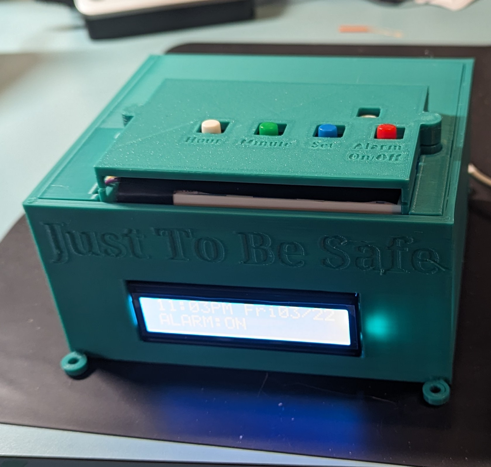

# Water Alarm Clock



## Table of Contents

<details><summary>Click to expand...</summary>

**- [Project Description](#project-description-1)**  
 &emsp;- [About the Product](#about-the-product)  
 &emsp;- [Inspiration](#inspiration)  
 &emsp;- [Project Showcase](#project-showcase)  
 &emsp;&emsp; [Video Overview](#video-overview)

**- [Project Credits](#project-credits)**  
 &emsp;- [Jonathan Hoffman](#jonathan-hoffman---product-owner)  
 &emsp;- [Tom Ryan](#tom-ryan---consulting-engineer)  
 &emsp;- [David Miles](#david-miles---software-developer)

**- [Documentation](#documentation-1)**  
 &emsp;- [Using Water Alarm](#using-water-alarm)  
 &emsp;&emsp;_- [Setting the Clock](#setting-the-clock)_  
 &emsp;&emsp;_- [Setting the Alarm](#setting-the-alarm)_  
 &emsp;&emsp;_- [Setting the Snooze](#setting-the-snooze)_  
 &emsp;&emsp;_- [Priming the Pump](#priming-the-pump)_  
 &emsp;- [Technical Notes](#technical-notes)  
 &emsp;&emsp;_- [Config Information](#config-information)_  
 &emsp;&emsp;_- [Installation (Raspberry Pi 4)](#install-on-raspberry-pi-4)_  
 &emsp;&emsp;_- [Installation (Raspberry Pi Zero W)]()_  
 &emsp;&emsp;_- [Run Program on Startup](#configure-to-run-on-startup)_  
 &emsp;- [Hardware](#hardware)  
 &emsp;- [Design](#design)  
 &emsp;- [Software](#software)  
 &emsp;&emsp;_- [Current Version](#current-version-10)_  
 &emsp;&emsp;_- [Version Release Notes](#version-release-notes)_

</details>

---

## Project Description

### About the Product

This is a project in development to create an alarm clock that will spray you with water to help heavy sleepers get out of bed in the morning. It has undergone many transformations since its inception, but it continues to be fun and challenging project that pushes our team to try and learn new things.

### Inspiration

This idea was conceived by Jonathan Hoffman, who has always thought outside of the box. He is a heavy sleeper, and wants something to get him moving quickly in the moring. I (David Miles) too the idea and ran with it. You can read more in our [bios](#project-credits) below about the roles we each play in the project if you're interested.

---

### Project Showcase

Contents:
[Video Overview](#video-overview) -
[Product Image](#product-image) -
[Design](#design)

#### [Video Overview](https://photos.app.goo.gl/3kBqhnxbUV3KdRak7)

**Click here to see a video about the project in it's current state:**  
**[Video Overview](https://photos.app.goo.gl/3kBqhnxbUV3KdRak7)**

#### Product Images

<details><summary>Click to see the product through its evolution.</summary>

&emsp;**Some pictures of the clock inside the 3D printed box.**


&emsp;**A picture of the "box build" for the computer components:**


&emsp;**- The alarm clock as of version 1.0:**


</details>

#### Debug Console

<details><summary>Click to learn about the debug console.</summary>

&emsp;- **The debug interface as of version 0.6:**


> This interface was used to:
>
> > **Test individual components of the project.** For example, when testing the buttons I would print a message to the screen when each button was depressed.
>
> > **Display the values of important variables.** When debugging, it was invaluable to know how my variables were set.
>
> > **Display the expected LCD output.** I sent the same string to the console as to the LCD. As I was getting the screen working, this was helpful because I knew if I didn't get the correct output, it was probably an error in my wiring.

</details>

---

## Project Credits

### Jonathan Hoffman - Product Owner

> Jonathan, or "Jono" as his friends call him, is the one who initiated this project. He is largely responsible for the mechanical design, and has selected pump and circuit equipment to be used in product construction.

### Tom Ryan - Consulting Engineer

> Tom has been an instrumental part of product testing, solution design, and general consulting.

### David Miles - Software Developer

> David is responsible for the software and small electronics portion of the project. He is also the one maintaining the project documentation.

---

## Documentation:

Contents:
[Using Water Alarm](#using-water-alarm) -
[Hardware](#hardware) -
[Design](#design) -
[Software](#software)

---

### Using Water Alarm:

Contents:
[Setting the Clock](#setting-the-clock) -
[Setting the Alarm](#setting-the-alarm) -
[Setting the Snooze](#setting-the-snooze) -
[Priming the Pump](#priming-the-pump)

#### Setting the Clock

<details><summary>Click to expand...</summary>

> > 1. Turn on the device.
>
> > 2. You will be prompted with some basic instructions, and then you will be asked to enter the date and time, one item at a time.
>
> > 3. Use the 'MINUTE' button to change the value on the screen. If you pass your desired value, simply keep going and it will circle around again.
> >    > Note: Time will need to be set in 24hr format. Clock will display AM/PM format.
>
> > 4. Use the 'HOUR' button to submit the value. Treat it like your 'ENTER' button.
>
> > 5. The system will verify you have entered a real date. If there is an error in the date, the system will restart and prompt you for the date and time again.

</details>

---

#### Setting the Alarm

<details><summary>Click to expand...</summary>

> > 1. Turn the alarm on by pressing the ON/OFF button. The screen should display "ALARM:ON"
>
> > 2. Hold down the 'SET ALARM' button. The alarm time should appear on the screen.
>
> > 3. With the 'SET ALARM' button depressed, press the 'HOUR' and 'MINUTE' buttons to set the alarm time.
>
> > 4. Release the set alarm button. You can check the alarm time at any time by pressing the 'SET ALARM. button.  
> >    Note: YOU WILL NEED TO [PRIME THE PUMP](#priming-the-pump) before using.

</details>

---

#### Priming the Pump

<details><summary>Click to expand...</summary>

> > 1. Fill pump reservoir.
>
> > 2. Ensure you have something to catch the water ejected during priming.
>
> > 3. Press 'HOUR' AND 'MINUTE' buttons at the same time. Pump will run as long as the buttons are depressed.

</details>

---

#### Setting the Snooze

<details><summary>Click to expand...</summary>

Note: Currently the only way to adjust the snooze is through the **config.py** file. Future versions will include a button for this feature.

> > 1. Open config.py with a text editor or the terminal:
> >
> > ```bash
> > cd path/to/water_alarm_clock
> > sudo nano config.py
> > ```
> >
> > \*Press CTRL+S to save, then CTRL+X to exit
>
> > 2. Set `SNOOZE_COUNT_CONFIG = #` where "#" is the number of times you would like snooze to sound (the pump to activate) in the one minute following the first alram. Values are listed below for reference.
> >
> > &emsp;`SNOOZE_COUNT_CONFIG = 1` (default setting): Alarm will sound once more in addition to the initial alarm. The number of seconds between the intial alarm and the snooze alarm is determined by MAX_SNOOZE_TIME.
> >
> > SNOOZE COUNT CONFIG...  
> > &emsp;&emsp;&emsp;&emsp;=1: See above.  
> > &emsp;&emsp;&emsp;&emsp;=2: Alarm will sound at +29 seconds and +58 seconds.  
> > &emsp;&emsp;&emsp;&emsp;=3: Alarm will sound at +19, +38 seconds and +57 seconds.  
> > &emsp;&emsp;&emsp;&emsp;=4: Alarm will sound +14, +28, +42, and +56 seconds.
>
> > 3. Set `MAX_SNOOZE_TIME` (default=30): The time in seconds between the intial alarm and the snooze alarm when SNOOZE_COUNT_CONFIG = 1.
> >
> > &emsp;Algorithm for determining snooze activation times:  
> > &emsp;`DELAY_TIME = (60 / SNOOZE_COUNT_CONFIG) - 1`

</details>

---

### Technical Notes

Contents:  
[Config Information](#config-information) -
[Dependencies](#dependencies) -
[Installation (Raspberry Pi 4)](#install-on-raspberry-pi-4) -
[Installation (Raspberry Pi Zero W)](#install-on-raspberry-pi-4) -
[Run on Startup](#configure-to-run-on-startup)

Note: This repo is located at http://github.com/DavidMiles1925/water_alarm_clock

---

#### Config Information

**IMPORTANT!!!**  
**Make sure the constant called LOG_DIRECTORY_PATH has the correct value set!**

Example:  
&emsp;`LOG_DIRECTORY_PATH = "/home/`**`YOUR PI NAME HERE`**`/water_alarm_clock/logs"`

<details><summary>Click to see detailed config information.</summary>

> **`LOG_DIRECTORY_PATH`** - The path that your logs will write to:
>
> > **`LOGGING_ENABLED`** - Turn logging on/off (True/False)
>
> > **`CONSOLE_OUTPUT_ON`** - Turn console output on/off (True/False)
>
> > **Pin assignments**
> >
> > `LED_PIN` = 27
> > `RELAY_PIN` = 21
> > `SET_BUTTON_PIN` = 13
> > `ALARM_BUTTON_PIN` = 26
> > `HOUR_BUTTON_PIN` = 6
> > `MINUTE_BUTTON_PIN` = 5
>
> > **These pin assignments are found in lcd.py** > > `LCD_RS` = 7 # Pi pin 26
> > `LCD_E` = 8 # Pi pin 24
> > `LCD_D4` = 25 # Pi pin 22
> > `LCD_D5` = 24 # Pi pin 18
> > `LCD_D6` = 23 # Pi pin 16
> > `LCD_D7` = 18 # Pi pin 12
>
> > These two variables determine default alarm time.
> > **`ALARM_HOUR`** - Set to an integer between 0 and 23
> > **`ALARM_MINUTE`** - Set to an integer between 0 and 59
>
> > **`ALARM_SET`** - This decides whether or not the alarm will be set when the device is powered on.
> > &emsp;Set True for ALARM: ON
> > &emsp;Set False for ALARM: OFF
>
> > **`ALARM_DURATION`** - Time in seconds the pump will run
> > **\*NOTE: In one second approx. 2oz of water comes through pump. Be careful setting this value too high!**
>
> > **`SNOOZE_COUNT_CONFIG`** - Used for determining how the snooze will function. Read below for more details.  
> > &emsp;if `SNOOZE_COUNT_CONFIG` = 1:
> > &emsp;&emsp;Pump will activate once more, in addition to intial alarm. The number of seconds between the intial alarm and the snooze alarm is determined by MAX_SNOOZE_TIME.
> >
> > &emsp;if `SNOOZE COUNT CONFIG` =
> > &emsp;&emsp;2: Alarm will sound at +29 seconds and +58 seconds
> > &emsp;&emsp;3: Alarm will sound at +19, +38 seconds and +57 seconds
> > &emsp;&emsp;4: Alarm will sound +14, +28, +42, and +56 seconds
> > &emsp;&emsp;5+: Use Algorithm: DELAY_TIME = ((60 / SNOOZE_COUNT_CONFIG) - 1)
>
> > **`MAX_SNOOZE_TIME`** - The time in seconds between the intial alarm and the snooze alarm when SNOOZE_COUNT_CONFIG = 1
>
> > **`BYPASS_SET_TIME`** - This variable is used to bypass setting the time on power-up. If set to 'True', the time will be pulled from the Wifi, or if there is no connection, it will be set to the epoc.  
> > &emsp;- False: User will set system time manually  
> > &emsp;- True: System time will be set to default
>
> > **`BYPASS_INSTRUCTIONS`** - This variable is used to bypass the instructions that display before setting the time.
> > &emsp;**\*Note**: If `BYPASS_SET_TIME` is set to True, this variable will have no effect.
> > &emsp;&emsp;False: Instructions will display at startup
> > &emsp;&emsp;True: Instructions will NOT display at startup
>
> > **`BUTTON_SLEEP_TIME_AFTER_PRESS`** - This is the amount of time that the buttons will 'sleep' after each press.

</details>

---

#### Install on Raspberry Pi 4:

<details><summary>Click to see installation instructions.</summary>

> > 1. Configure git:  
> >    &emsp;a. Install git: [Click Here To Install Git](https://git-scm.com/book/en/v2/Getting-Started-Installing-Git)  
> >    &emsp;b. Configure:
> >
> > ```bash
> > git config --global user.name "yourusername"
> > git config --global user.email "your@email"
> > ```
> >
> > &emsp;c. Create GitHub Access Token: [Instructions here](https://docs.github.com/en/authentication/keeping-your-account-and-data-secure/managing-your-personal-access-tokens#creating-a-personal-access-token-classic)  
> > **SAVE THIS KEY IMMEDIATELY! YOU WILL NOT BE ABLE TO ACCESS IT AGAIN.**
>
> > 2. Clone repo:  
> >    &emsp;a. In the terminal, navigate to your desired directory and enter this command:
> >
> > ```bash
> > git clone https://github.com/DavidMiles1925/water_alarm_clock.git
> > ```
> >
> > &emsp;b. You will be prompted for username and key (it is labeled password).  
> > **Copy and paste the key generated in step 1c as the password.**
>
> > 3. Run program:  
> >    &emsp;a. Run program in console:
> >
> > ```bash
> > cd path/to/program
> > python main.py
> > ```
> >
> > &emsp;b. [Configure for startup](#configure-to-run-on-startup)

</details>

---

#### Install on Raspberry Pi Zero W:

<details><summary>Click to see installation instructions.</summary>

1. Follow [these instructions](http://github.com/DavidMiles1925/pi_zero_setup) to set up the Pi.  
   &emsp;- Also, if you require authentication, follow instructions in the above section [Intallation on Pi 4](#install-on-raspberry-pi-4)

2. Run these commands to run program

```bash
git clone https://github.com/DavidMiles1925/water_alarm_clock.git
cd water_alarm_clock
python main.py
```

</details>

---

#### Configure to Run On Startup:

<details><summary>Click to see installation instructions.</summary>

> > 1. Modify etc/rc.local with admin priviliges:
> >
> > ```bash
> > cd /etc
> > sudo nano rc.local
> > ```
> >
> > 2. Added this line to /etc/rc.local:
> >
> > ```bash
> > sudo python /home/pi/water_alarm_clock/main.py &
> > ```
>
> > 3. To stop the process, first find the pid number:
> >
> > ```bash
> > ps aux | grep "main.py"
> > ```
>
> > 4. Note the number in the second column.
>
> > 5. Terminate process:
> >
> > ```bash
> > sudo kill -TERM ###
> > ```
> >
> > &emsp;\*replace "###" with the number from step 4

</details>

---

### Hardware:

> Pump info needed  
> Converter info needed  
> [Raspberry Pi Zero W](https://www.raspberrypi.com/products/) > [1602 LCD Screen](https://lastminuteengineers.com/arduino-1602-character-lcd-tutorial/)  
> [B10K Ohm Potentiometer](https://components101.com/resistors/potentiometer)  
> [5V SL-C Relay](https://www.datasheetcafe.com/srd-05vdc-sl-c-datasheet-pdf/)  
> [4-pin buttons x4](https://components101.com/switches/push-button)  
> [Pack of Jumper Wires](https://www.amazon.com/EDGELEC-Breadboard-Optional-Assorted-Multicolored/dp/B07GD2BWPY/ref=mp_s_a_1_4_maf_2?keywords=jumper+wires&qid=1698723823&sr=8-4)  
> [220 Ohm Resistors x5](https://www.amazon.com/EDGELEC-Resistor-Tolerance-Multiple-Resistance/dp/B07QK9ZBVZ/ref=asc_df_B07QK9ZBVZ/?tag=hyprod-20&linkCode=df0&hvadid=366282353997&hvpos=&hvnetw=g&hvrand=1493730756178399250&hvpone=&hvptwo=&hvqmt=&hvdev=m&hvdvcmdl=&hvlocint=&hvlocphy=9023859&hvtargid=pla-804889355024&psc=1&tag=&ref=&adgrpid=79957163727&hvpone=&hvptwo=&hvadid=366282353997&hvpos=&hvnetw=g&hvrand=1493730756178399250&hvqmt=&hvdev=m&hvdvcmdl=&hvlocint=&hvlocphy=9023859&hvtargid=pla-804889355024) > [1K Ohm Resistors x4]()
> LED x1

---

### Design


---

### Software:

Contents:
[Current Version](#current-version-10) -
[Future Versions](#future-versions) -
[Version Release Notes](#version-release-notes) -

---

#### Current Version: 1.2

This version is a fully functional version of the software that has been tested with the hardware. It has a printed case, and is awaiting pump nozzel adjustments. The next step is to build a full prototype of the final Water Alarm product.

---

#### Version Release Notes:

<details>
    <summary>Click to see version notes:</summary>

##### Version 1.1

> &emsp;- added better error handling
> &emsp;- README updates
> &emsp;- Primer made to be constant flow
> &emsp;- Switched hour and minute GPIO pins

##### Version 1.0

> &emsp;- created set_system_time() function  
> &emsp;- added set time logic  
> &emsp;- README:  
> &emsp;&emsp;- add set time instructions

##### Version: 0.7

> &emsp;- added snooze feature  
> &emsp;- tweaked snooze output  
> &emsp;- adjusted lcd performance  
> &emsp;- README:  
> &emsp;&emsp;- added overview video  
> &emsp;&emsp;- added technical notes section  
> &emsp;&emsp;- general fixes

##### Version 0.6

> &emsp;- configured to run on startup  
> &emsp;- Minor improvements:  
> &emsp;&emsp;- optimized sleep times  
> &emsp;&emsp;- added exit message on lcd  
> &emsp;&emsp;-re-introduced debugging for porting  
> &emsp;- Reformated board layout for efficiency  
> &emsp;- README:  
> &emsp;&emsp;- Project recap  
> &emsp;&emsp;- Videos/images  
> &emsp;&emsp;- add hardware links  
> &emsp;&emsp;- add screen wiring diagram

##### Version 0.5

> &emsp;- added AM/PM logic  
> &emsp;- formated output for AM/PM  
> &emsp;- integrated screen  
> &emsp;- calibrated potentiometer  
> &emsp;- generated screen output to match debug output  
> &emsp;- reformatted code for easier reading

##### Version 0.4

> &emsp;- Created basic alarm logic  
> &emsp;- integrated indicator LED  
> &emsp;- integrated relay circuit  
> &emsp;- test all components

##### Version 0.3

> &emsp;- Set up GPIO pins  
> &emsp;- integrated buttons:  
> &emsp;&emsp;- alarm on/off  
> &emsp;&emsp;- set alarm  
> &emsp;&emsp;- hour  
> &emsp;&emsp;- minute  
> &emsp;- configured button logic  
> &emsp;- console debug formatting adjustments  
> &emsp;- README:  
> &emsp;&emsp;- added table of contents

##### Version 0.2

> &emsp;- adjusted time output formatting  
> &emsp;- created debug output to console  
> &emsp;- README update:  
> &emsp;&emsp;- hardware  
> &emsp;&emsp;- future versioning

##### Version 0.1

> &emsp;- Created main function  
> &emsp;- Created basic utilities library  
> &emsp;- Created configuration file  
> &emsp;- Initialized repository  
> &emsp;- Incorporated bare-bones error handling  
> &emsp;- Started README

</details>
